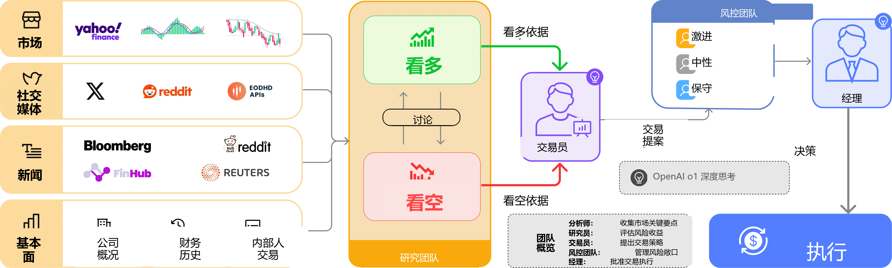
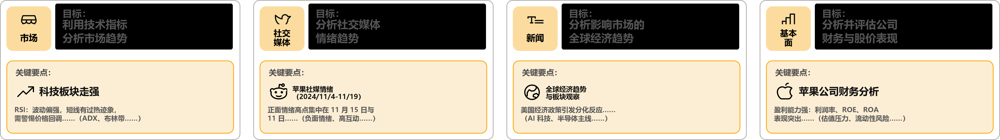
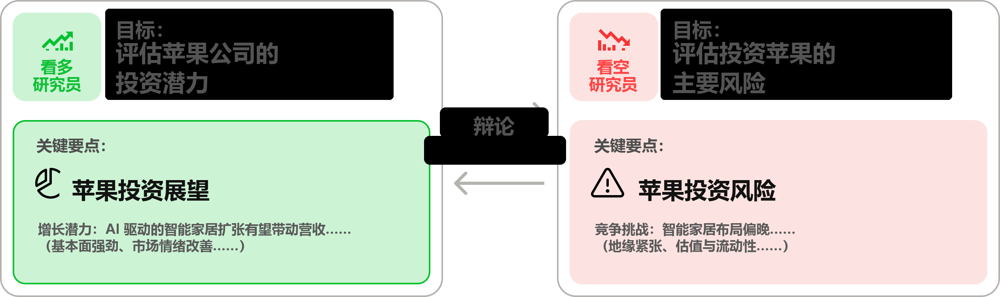
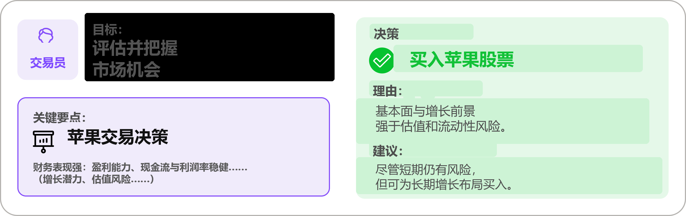
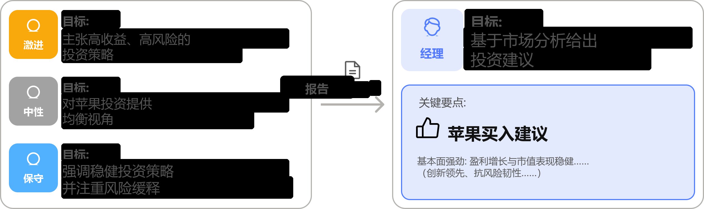

<p align="center">
  
</p>

<div align="center" style="line-height: 1;">
  <a href="https://arxiv.org/abs/2412.20138" target="_blank"></a>
  <a href="https://discord.com/invite/hk9PGKShPK" target="_blank"></a>
  <a href="./assets/wechat.png" target="_blank"></a>
  <a href="https://x.com/TauricResearch" target="_blank"></a>
  <br>
  <a href="https://github.com/TauricResearch/" target="_blank"></a>
</div>

<div align="center">
  <!-- 保留这些链接。README 更新后，多语言版本会自动同步。 -->
  <a href="https://www.readme-i18n.com/TauricResearch/TradingAgents?lang=de">Deutsch</a> | 
  <a href="https://www.readme-i18n.com/TauricResearch/TradingAgents?lang=es">Español</a> | 
  <a href="https://www.readme-i18n.com/TauricResearch/TradingAgents?lang=fr">français</a> | 
  <a href="https://www.readme-i18n.com/TauricResearch/TradingAgents?lang=ja">日本語</a> | 
  <a href="https://www.readme-i18n.com/TauricResearch/TradingAgents?lang=ko">한국어</a> | 
  <a href="https://www.readme-i18n.com/TauricResearch/TradingAgents?lang=pt">Português</a> | 
  <a href="https://www.readme-i18n.com/TauricResearch/TradingAgents?lang=ru">Русский</a> | 
  <a href="https://www.readme-i18n.com/TauricResearch/TradingAgents?lang=zh">中文</a>
</div>

---

# TradingAgents：多智能体 LLM 金融交易框架

## 最新动态
- [2026-03] **TradingAgents v0.2.3** 发布，新增多语言支持、GPT-5.4 系列模型、统一模型目录、回测日期一致性以及代理支持。
- [2026-03] **TradingAgents v0.2.2** 发布，覆盖 GPT-5.4 / Gemini 3.1 / Claude 4.6 模型，新增五档评级尺度、OpenAI Responses API、Anthropic effort 控制以及跨平台稳定性改进。
- [2026-02] **TradingAgents v0.2.0** 发布，新增多提供方 LLM 支持（GPT-5.x、Gemini 3.x、Claude 4.x、Grok 4.x），并改进整体系统架构。
- [2026-01] **Trading-R1** [技术报告](https://arxiv.org/abs/2509.11420) 已发布，[Terminal](https://github.com/TauricResearch/Trading-R1) 预计很快上线。

<div align="center">
<a href="https://www.star-history.com/#TauricResearch/TradingAgents&Date">
 <picture>
   <source media="(prefers-color-scheme: dark)" srcset="https://api.star-history.com/svg?repos=TauricResearch/TradingAgents&type=Date&theme=dark" />
   <source media="(prefers-color-scheme: light)" srcset="https://api.star-history.com/svg?repos=TauricResearch/TradingAgents&type=Date" />
   
 </picture>
</a>
</div>

> 🎉 **TradingAgents** 已正式发布！我们收到了大量关于这项工作的咨询，也非常感谢社区的热情关注。
>
> 因此我们决定将整套框架完全开源。期待和你一起构建真正有影响力的项目！

<div align="center">

🚀 [TradingAgents 框架](#tradingagents-框架) | ⚡ [安装与 CLI](#安装与-cli) | 🎬 [演示视频](https://www.youtube.com/watch?v=90gr5lwjIho) | 📦 [Package 用法](#tradingagents-package) | 🤝 [参与贡献](#参与贡献) | 📄 [引用](#引用)

</div>

## TradingAgents 框架

TradingAgents 是一个多智能体交易框架，用来模拟真实交易机构中的协作动态。系统会部署一组由 LLM 驱动的专业代理，从基本面分析师、情绪分析专家、技术分析师，到交易员与风控团队，共同评估市场环境并辅助生成交易决策。除此之外，这些代理还会进行动态讨论，以寻找更优策略。

<p align="center">
  
</p>

> TradingAgents 框架用于研究目的。交易表现会受到多种因素影响，包括所选基础语言模型、模型温度、交易周期、数据质量以及其他非确定性因素。[它并不构成金融、投资或交易建议。](https://tauric.ai/disclaimer/)

我们的框架将复杂的交易任务拆解为多个专业角色，从而让系统以更稳健、可扩展的方式完成市场分析与决策。

### 分析师团队
- 基本面分析师：评估公司财务状况与经营指标，识别内在价值与潜在风险信号。
- 情绪分析师：分析社交媒体与公众情绪，并利用情绪评分方法判断短期市场氛围。
- 新闻分析师：跟踪全球新闻与宏观经济指标，解读事件对市场环境的影响。
- 技术分析师：利用技术指标（如 MACD、RSI）识别交易模式并预测价格走势。

<p align="center">
  
</p>

### 研究团队
- 由看多与看空两类研究员组成，对分析师团队产出的洞见进行审视与辩论。通过结构化讨论，在收益机会与固有风险之间取得平衡。

<p align="center">
  
</p>

### 交易员代理
- 交易员会整合分析师与研究团队的报告，形成更有依据的交易决策，并根据综合市场洞察判断交易时机与仓位规模。

<p align="center">
  
</p>

### 风控团队与投资组合经理
- 风控团队会持续评估组合风险，包括市场波动、流动性及其他风险因素；同时对交易策略进行评估与调整，并将评估报告提交给投资组合经理做最终判断。
- 投资组合经理负责批准或拒绝交易提案。若批准，订单会被发送到模拟交易所并执行。

<p align="center">
  
</p>

## 安装与 CLI

### 安装

克隆 TradingAgents：
```bash
git clone https://github.com/TauricResearch/TradingAgents.git
cd TradingAgents
```

使用你喜欢的环境管理器创建虚拟环境：
```bash
conda create -n tradingagents python=3.13
conda activate tradingagents
```

安装项目及其依赖：
```bash
pip install .
```

### Docker

也可以通过 Docker 运行：
```bash
cp .env.example .env  # add your API keys
docker compose run --rm tradingagents
```

如果使用 Ollama 本地模型：
```bash
docker compose --profile ollama run --rm tradingagents-ollama
```

### 必需 API

TradingAgents 支持多个 LLM 提供方。请为你选择的提供方设置对应 API Key：

```bash
export OPENAI_API_KEY=...          # OpenAI (GPT)
export GOOGLE_API_KEY=...          # Google (Gemini)
export ANTHROPIC_API_KEY=...       # Anthropic (Claude)
export XAI_API_KEY=...             # xAI (Grok)
export DEEPSEEK_API_KEY=...        # DeepSeek
export DASHSCOPE_API_KEY=...       # Qwen (Alibaba DashScope)
export ZHIPU_API_KEY=...           # GLM (Zhipu)
export OPENROUTER_API_KEY=...      # OpenRouter
export ALPHA_VANTAGE_API_KEY=...   # Alpha Vantage
```

如果使用企业级提供方（例如 Azure OpenAI、AWS Bedrock），请将 `.env.enterprise.example` 复制为 `.env.enterprise`，然后填入你的凭据。

如果使用本地模型，请在配置中将 `llm_provider` 设为 `ollama`。

你也可以把 `.env.example` 复制为 `.env`，再填入自己的密钥：
```bash
cp .env.example .env
```

### CLI 使用方法

启动交互式 CLI：
```bash
tradingagents          # installed command
python -m cli.main     # alternative: run directly from source
```
随后你会看到一组交互式界面，可选择股票代码、分析日期、LLM 提供方、研究深度等参数。

<p align="center">
  
</p>

分析过程中会出现实时界面，你可以在代理运行时观察结果逐步加载与推进。

<p align="center">
  
</p>

<p align="center">
  
</p>

## TradingAgents Package

### 实现细节

我们基于 LangGraph 构建了 TradingAgents，以确保框架具备灵活性与模块化能力。当前框架支持多个 LLM 提供方：OpenAI、Google、Anthropic、xAI、OpenRouter 和 Ollama。

### Python 用法

如果你想在自己的代码里使用 TradingAgents，可以导入 `tradingagents` 模块并初始化一个 `TradingAgentsGraph()` 对象。`.propagate()` 会返回一个决策结果。你可以直接运行 `main.py`，下面也给出一个快速示例：

```python
from tradingagents.graph.trading_graph import TradingAgentsGraph
from tradingagents.default_config import DEFAULT_CONFIG

ta = TradingAgentsGraph(debug=True, config=DEFAULT_CONFIG.copy())

# forward propagate
_, decision = ta.propagate("NVDA", "2026-01-15")
print(decision)
```

你也可以调整默认配置，自定义所用 LLM、辩论轮数等参数。

```python
from tradingagents.graph.trading_graph import TradingAgentsGraph
from tradingagents.default_config import DEFAULT_CONFIG

config = DEFAULT_CONFIG.copy()
config["llm_provider"] = "openai"        # openai, google, anthropic, xai, openrouter, ollama
config["deep_think_llm"] = "gpt-5.4"     # Model for complex reasoning
config["quick_think_llm"] = "gpt-5.4-mini" # Model for quick tasks
config["max_debate_rounds"] = 2

ta = TradingAgentsGraph(debug=True, config=config)
_, decision = ta.propagate("NVDA", "2026-01-15")
print(decision)
```

全部配置项请查看 `tradingagents/default_config.py`。

## 参与贡献

欢迎社区参与贡献！无论是修复 bug、改进文档，还是提出新特性建议，你的输入都会帮助这个项目变得更好。如果你对这条研究方向感兴趣，也欢迎加入我们的开源金融 AI 研究社区 [Tauric Research](https://tauric.ai/)。

## 引用

如果你觉得 *TradingAgents* 对你有帮助，欢迎引用我们的工作：

```
@misc{xiao2025tradingagentsmultiagentsllmfinancial,
      title={TradingAgents: Multi-Agents LLM Financial Trading Framework}, 
      author={Yijia Xiao and Edward Sun and Di Luo and Wei Wang},
      year={2025},
      eprint={2412.20138},
      archivePrefix={arXiv},
      primaryClass={q-fin.TR},
      url={https://arxiv.org/abs/2412.20138}, 
}
```
